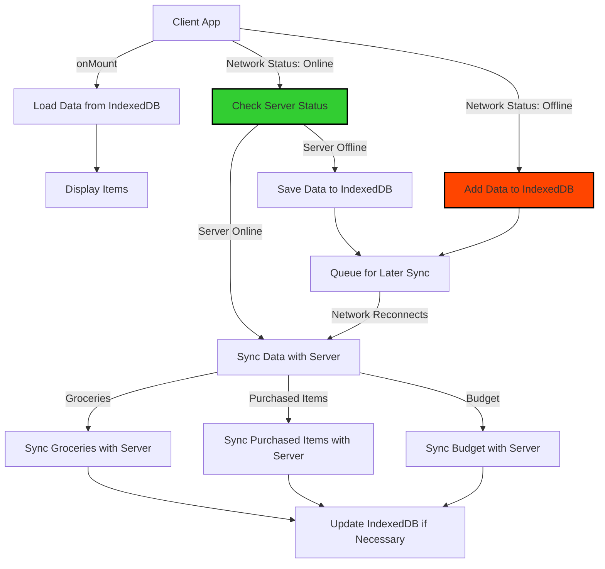
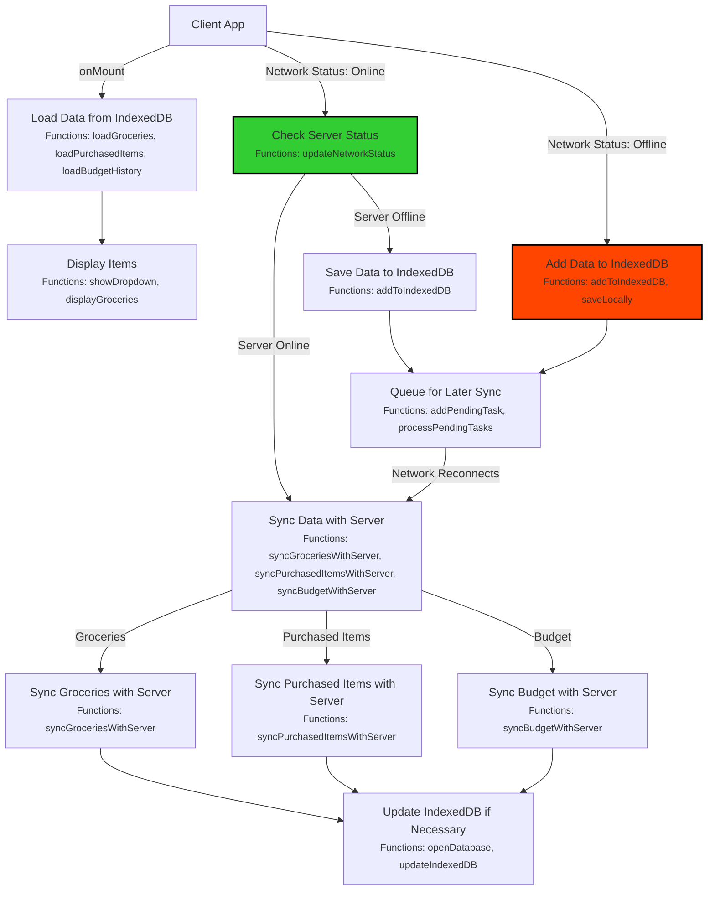

```mermaid
graph TD
    A[Client App] -->|onMount| B[Load Data from IndexedDB]
    B --> C[Display Items]
    A -->|Network Status: Online| D[Check Server Status]
    D -->|Server Online| E[Sync Data with Server]
    E -->|Groceries| F[Sync Groceries with Server]
    E -->|Purchased Items| G[Sync Purchased Items with Server]
    E -->|Budget| H[Sync Budget with Server]
    F --> I[Update IndexedDB if Necessary]
    G --> I
    H --> I
    D -->|Server Offline| J[Save Data to IndexedDB]
    J --> K[Queue for Later Sync]
    A -->|Network Status: Offline| L[Add Data to IndexedDB]
    L --> K
    K -->|Network Reconnects| E

    classDef online fill:#32CD32,stroke:#000,stroke-width:2px;
    classDef offline fill:#FF4500,stroke:#000,stroke-width:2px;

    D:::online
    L:::offline
```

```mermaid
graph TD
    A[Client App] -->|onMount| B[Load Data from IndexedDB<br><small>Functions: loadGroceries, loadPurchasedItems, loadBudgetHistory</small>]
    B --> C[Display Items<br><small>Functions: showDropdown, displayGroceries</small>]
    A -->|Network Status: Online| D[Check Server Status<br><small>Functions: updateNetworkStatus</small>]
    D -->|Server Online| E[Sync Data with Server<br><small>Functions: syncGroceriesWithServer, syncPurchasedItemsWithServer, syncBudgetWithServer</small>]
    E -->|Groceries| F[Sync Groceries with Server<br><small>Functions: syncGroceriesWithServer</small>]
    E -->|Purchased Items| G[Sync Purchased Items with Server<br><small>Functions: syncPurchasedItemsWithServer</small>]
    E -->|Budget| H[Sync Budget with Server<br><small>Functions: syncBudgetWithServer</small>]
    F --> I[Update IndexedDB if Necessary<br><small>Functions: openDatabase, updateIndexedDB</small>]
    G --> I
    H --> I
    D -->|Server Offline| J[Save Data to IndexedDB<br><small>Functions: addToIndexedDB</small>]
    J --> K[Queue for Later Sync<br><small>Functions: addPendingTask, processPendingTasks</small>]
    A -->|Network Status: Offline| L[Add Data to IndexedDB<br><small>Functions: addToIndexedDB, saveLocally</small>]
    L --> K
    K -->|Network Reconnects| E

    classDef online fill:#32CD32,stroke:#000,stroke-width:2px;
    classDef offline fill:#FF4500,stroke:#000,stroke-width:2px;

    D:::online
    L:::offline

```