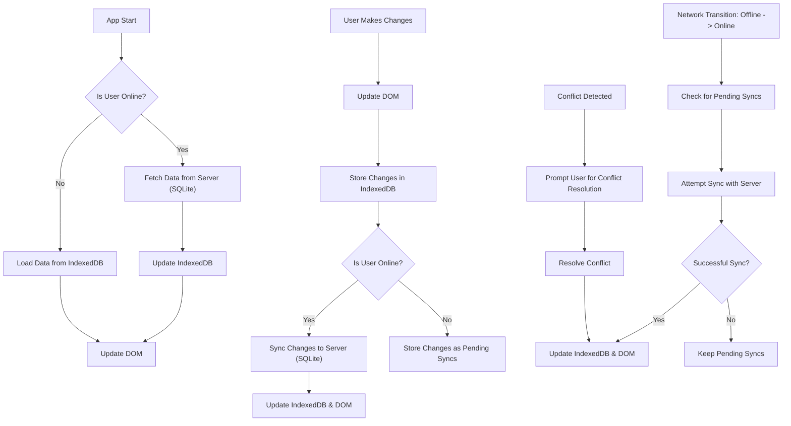
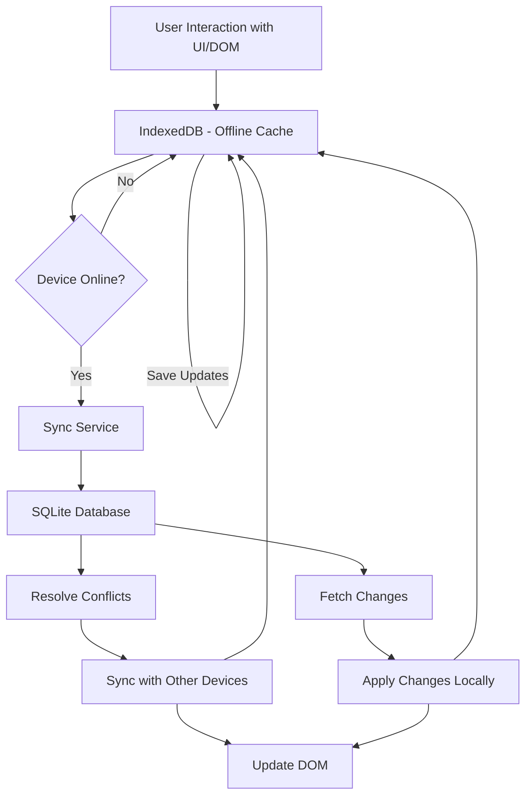
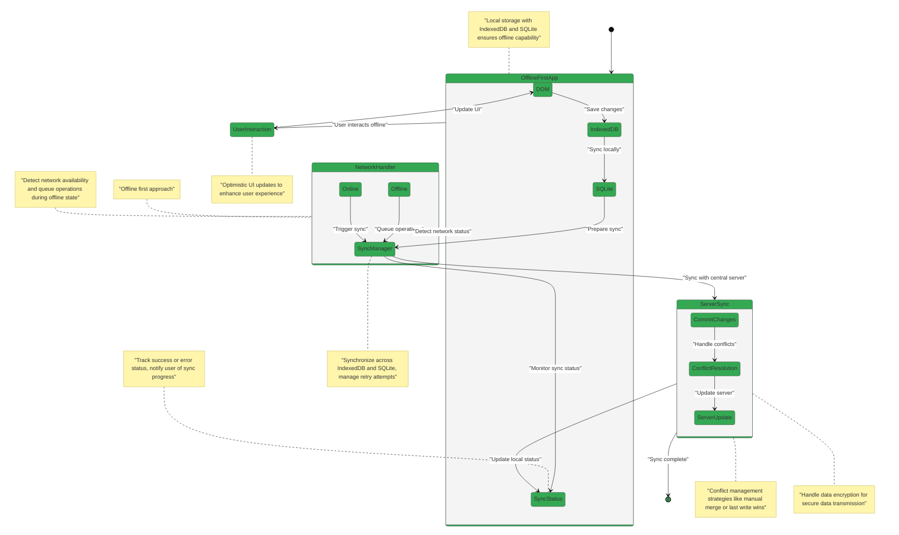

Best practices for creating an offline-first app:

- Use **local storage** (IndexedDB/SQLite) for offline data persistence.
- Implement a **sync manager** to track changes and synchronize data.
- Use **conflict resolution** strategies (e.g., manual merge, last write wins).
- **Monitor network status** to manage online/offline operations.
- Provide **user feedback** on sync status and network state.
- Ensure **graceful degradation** for offline user experience.
- Implement **retry mechanisms** for failed sync attempts.
- Use **service workers** for caching resources.
- Perform **optimistic UI updates** to improve user experience.
- Handle **data encryption** for secure storage and transmission.
- Regularly **test offline scenarios** for resilience.
  